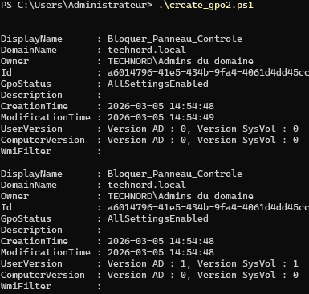
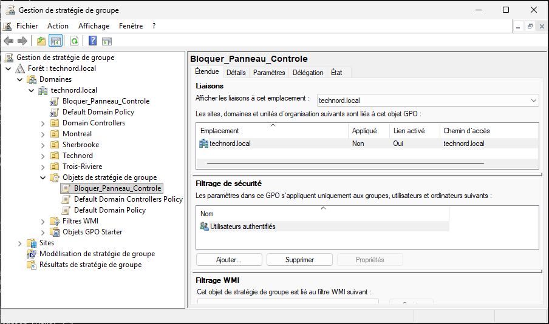
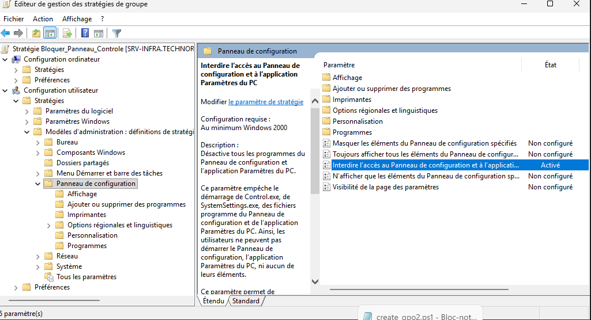
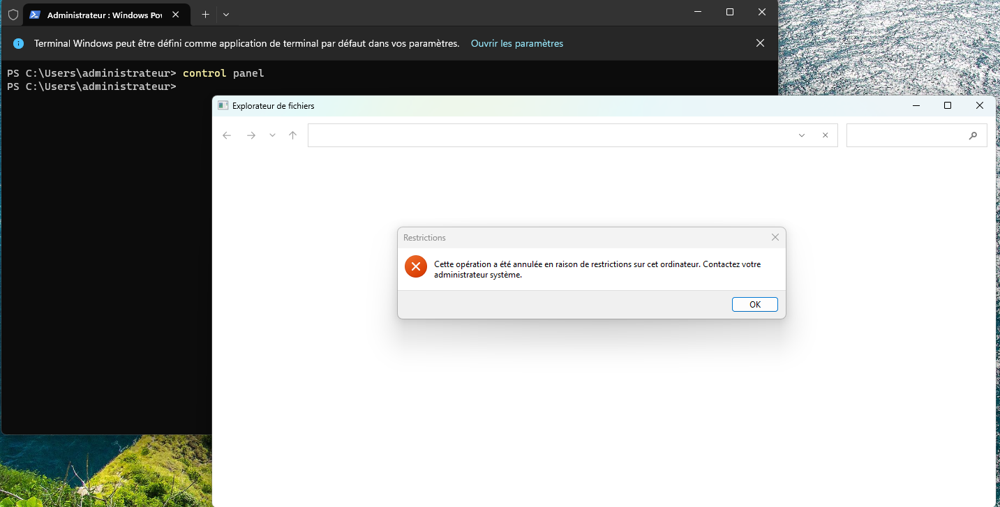

# Lab 01 - Automatisation GPO avec PowerShell

## Objectif
Créer automatiquement une GPO afin de bloquer l'accès au panneau de configuration.

## Environnement
- Windows Server 2022
- Active Directory
- Windows 11 Client
- Domaine : technord.local

## Script

Le script PowerShell crée une GPO et applique la configuration suivante :

NoControlPanel = 1

## Screenshots

### Script exécuté

### GPO créée

### Paramètre configuré

### Résultat sur le poste client

