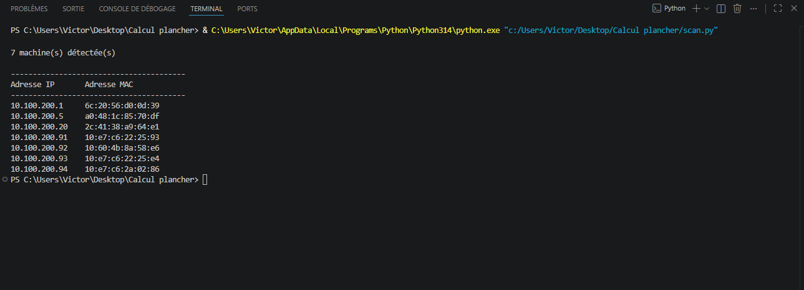

# 🌐 Network Host Discovery Tool

---

## 📖 Description

Ce projet consiste à développer un outil Python permettant de découvrir automatiquement les hôtes actifs sur un réseau local.

L'application utilise le protocole ARP afin d'identifier les appareils connectés au même VLAN et d'afficher leurs adresses IP ainsi que leurs adresses MAC.

Ce projet démontre l'utilisation de Python pour l'automatisation de tâches liées à la cybersécurité et à l'administration réseau.

---

## 🎯 Objectifs

- Découvrir les hôtes actifs sur un réseau local
- Comprendre le fonctionnement du protocole ARP
- Automatiser l'inventaire d'un réseau
- Développer un outil réseau avec Python
- Approfondir les concepts de réseautique et de cybersécurité

---

## 🛠️ Technologies utilisées

- Python 3
- Scapy
- Npcap
- ARP (Address Resolution Protocol)
- Ethernet

---

## 🧠 Concepts démontrés

- Découverte d'hôtes (Host Discovery)
- Communication de niveau 2 (Layer 2)
- Trames Ethernet
- Requêtes ARP Broadcast
- Adressage IPv4
- Sous-réseaux CIDR
- Automatisation réseau
- Analyse d'infrastructures locales

---

## ⚙️ Installation

### Installer les dépendances

```bash
pip install scapy
```

### Installer Npcap (Windows)

Télécharger et installer Npcap :

https://npcap.com/

Lors de l'installation :

✅ Install Npcap in WinPcap API-compatible Mode

---

## 🚀 Utilisation

Modifier le réseau à scanner :

```python
reseau = "192.168.10.0/24"
```

Lancer l'application :

```bash
python scan.py
```

---

## 📸 Résultat

### Exemple d'exécution



---

## 📂 Structure du projet

```text
network-host-discovery/
│
├── screenshots/
│   └── resultat-scan.png
│
├── scan.py
├── requirements.txt
└── README.md
```

---

## 🔍 Fonctionnement

1. Création d'une requête ARP ciblant un sous-réseau.
2. Encapsulation dans une trame Ethernet Broadcast.
3. Envoi de la requête à tous les hôtes du réseau local.
4. Réception des réponses ARP.
5. Extraction des adresses IP et MAC.
6. Affichage des résultats à l'utilisateur.

---

## 📋 Exemple de sortie

```text
Scan en cours...

18 machine(s) détectée(s)

----------------------------------------
Adresse IP       Adresse MAC
----------------------------------------
192.168.10.1     00:11:22:33:44:55
192.168.10.10    AA:BB:CC:DD:EE:01
192.168.10.11    AA:BB:CC:DD:EE:02
```

---

## 🔐 Considérations de sécurité

Cet outil est conçu à des fins éducatives et doit être utilisé uniquement sur des réseaux dont vous possédez l'autorisation.

Le balayage ARP permet uniquement la découverte des hôtes présents sur le même réseau local et ne permet pas l'accès aux systèmes détectés.

---

## 🚧 Améliorations futures

- [ ] Détection du nom d'hôte
- [ ] Export CSV
- [ ] Export JSON
- [ ] Interface graphique (Tkinter)
- [ ] Scan multi-réseaux
- [ ] Journalisation des résultats

---

## 💼 Compétences démontrées

- Python
- Réseautique
- Cybersécurité
- Analyse réseau
- Protocoles TCP/IP
- Automatisation
- Résolution de problèmes

---

## 👨‍💻 Auteur

**Victor Galipeau**

Projet réalisé dans le cadre de mon parcours en cybersécurité et de la construction de mon portfolio GitHub.
