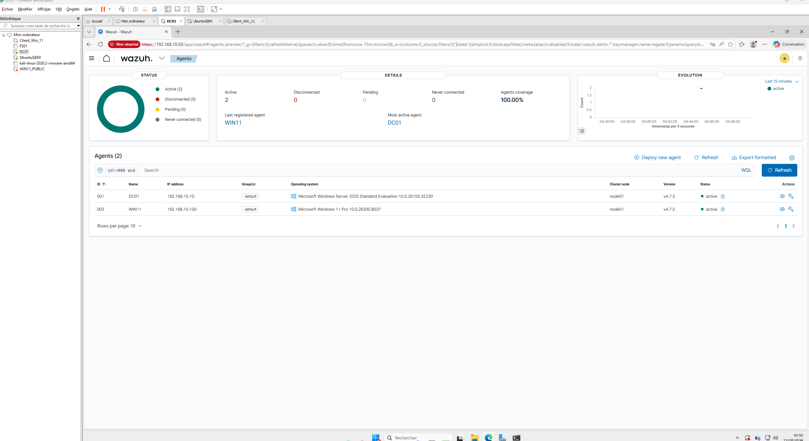
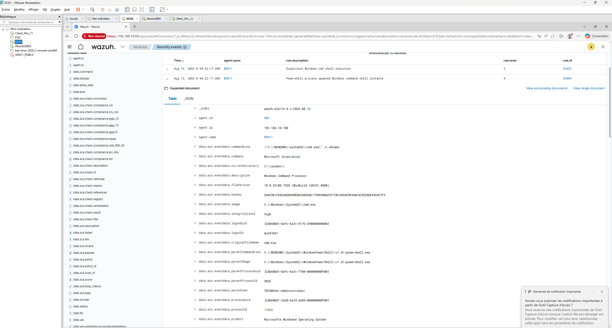
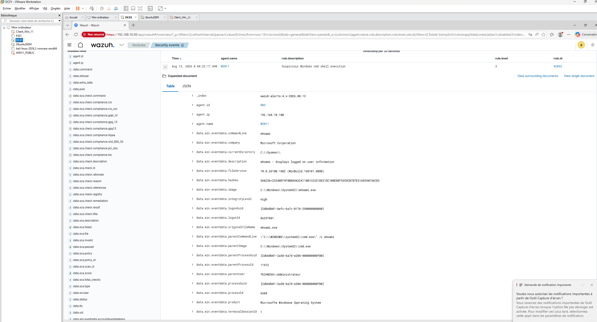
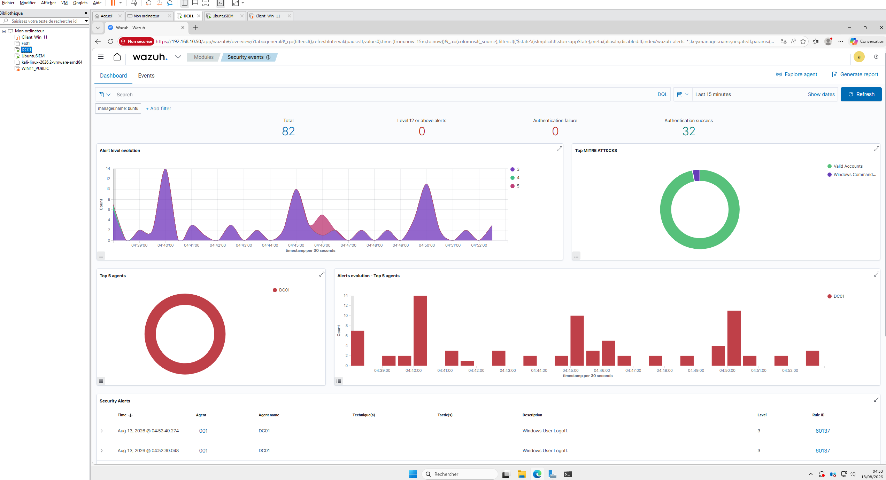
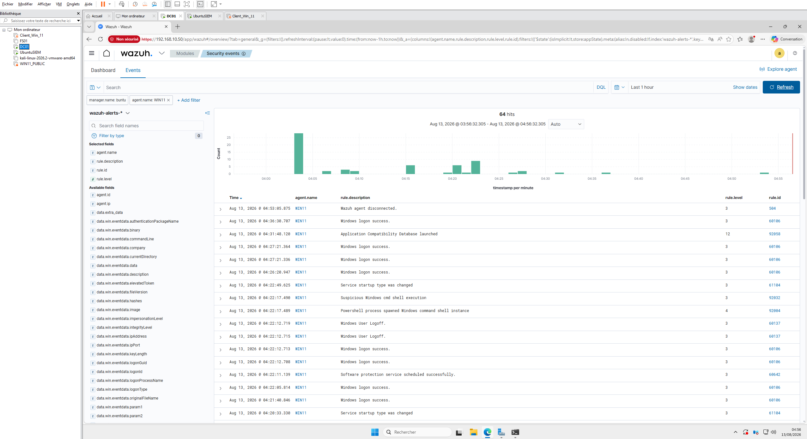

# 🛡️ Laboratoire SOC — Wazuh, Sysmon & Windows

> Laboratoire de cybersécurité pratique axé sur la surveillance des postes Windows, la collecte de télémétrie, la détection d'activités suspectes et l'analyse avec MITRE ATT&CK.


---

## 🎯 Présentation du projet

Ce projet consiste en la création d'un laboratoire SOC personnel permettant de reproduire certains processus utilisés dans un environnement réel de centre opérationnel de sécurité (SOC).

L'objectif est de mettre en place une infrastructure permettant de :

- surveiller un poste Windows ;
- collecter les événements de sécurité ;
- analyser les processus exécutés ;
- détecter des comportements suspects ;
- générer des alertes ;
- analyser les événements dans un SIEM ;
- associer les comportements observés à MITRE ATT&CK ;
- pratiquer les méthodes d'investigation utilisées par un analyste SOC.

Le laboratoire est entièrement isolé et utilisé uniquement à des fins d'apprentissage et de cybersécurité défensive.

---

# 🏗️ Architecture

```text
                         ┌─────────────────────┐
                         │      Windows 11     │
                         │    192.168.10.100    │
                         │                     │
                         │       Sysmon        │
                         └──────────┬──────────┘
                                    │
                                    │ Windows Event Channel
                                    ▼
                         ┌─────────────────────┐
                         │    Agent Wazuh      │
                         │        WIN11        │
                         └──────────┬──────────┘
                                    │
                                    │ TCP 1514
                                    ▼
                         ┌─────────────────────┐
                         │   Ubuntu / Wazuh    │
                         │      Manager        │
                         │    192.168.10.50    │
                         └──────────┬──────────┘
                                    │
                       ┌────────────┴────────────┐
                       │                         │
                       ▼                         ▼
                ┌───────────────┐       ┌────────────────┐
                │ Règles Wazuh  │       │ MITRE ATT&CK   │
                │ & décodeurs   │       │   Mappage      │
                └───────┬───────┘       └────────────────┘
                        │
                        ▼
                ┌─────────────────┐
                │ Tableau de bord │
                │     Wazuh       │
                └─────────────────┘
```

---

# 🌐 Infrastructure du laboratoire

| Machine | Rôle | Adresse IP |
|---|---|---|
| DC01 | Active Directory / DNS | `192.168.10.10` |
| Ubuntu | Wazuh Manager | `192.168.10.50` |
| WIN11 | Poste surveillé | `192.168.10.100` |

---

# 🔧 Technologies utilisées

| Technologie | Utilisation |
|---|---|
| Wazuh | SIEM / surveillance de sécurité |
| Sysmon | Télémétrie avancée Windows |
| Windows 11 | Poste surveillé |
| Ubuntu | Serveur Wazuh |
| Active Directory | Environnement d'identité |
| PowerShell | Administration et génération de télémétrie |
| MITRE ATT&CK | Classification des comportements |
| VMware | Virtualisation |
| Python | Automatisation prévue |

---

# 📡 Flux de télémétrie

Le cheminement des événements est le suivant :

```text
Activité Windows
       ↓
     Sysmon
       ↓
Windows Event Channel
       ↓
  Agent Wazuh
       ↓
Wazuh Manager
       ↓
   Décodeur
       ↓
 Règle Wazuh
       ↓
MITRE ATT&CK
       ↓
Alerte Wazuh
       ↓
Investigation SOC
```

---

# ✅ Phase 1 — Mise en place de la télémétrie

## Enrôlement de l'agent Windows

Le poste Windows 11 a été correctement enrôlé auprès du serveur Wazuh.

```text
ID de l'agent : 003
Nom :          WIN11
IP :            192.168.10.100
Statut :        Active
```



---

# 🖥️ Intégration de Sysmon

Sysmon a été configuré afin de collecter les événements provenant du canal :

```text
Microsoft-Windows-Sysmon/Operational
```

L'agent Wazuh utilise notamment la configuration suivante :

```xml
<localfile>
    <location>Microsoft-Windows-Sysmon/Operational</location>
    <log_format>eventchannel</log_format>
</localfile>
```

Cette configuration permet à Wazuh de récupérer les événements Sysmon directement à partir du journal d'événements Windows.

---

# 🔎 Sysmon Event ID 1 — Création de processus

L'un des principaux événements utilisés dans ce laboratoire est :

```text
Sysmon Event ID 1
Process Create
```

Cet événement fournit notamment :

- le processus exécuté ;
- la ligne de commande ;
- le processus parent ;
- la ligne de commande du processus parent ;
- le PID ;
- le PID du processus parent ;
- l'utilisateur ;
- le niveau d'intégrité ;
- le GUID du processus ;
- les empreintes cryptographiques.

Ces informations permettent notamment de reconstruire les relations entre les processus.

---

# ⚡ Détection 1 — PowerShell

Un test contrôlé a été effectué afin de générer une activité PowerShell :

```powershell
Start-Process powershell.exe -ArgumentList "-NoProfile -Command `"Get-Process`""
```

La relation entre les processus observée était :

```text
PowerShell
    │
    └── PowerShell
          │
          └── Get-Process
```

Wazuh a généré l'alerte :

```text
ID de règle : 92027
Niveau :     4

Description :
Powershell process spawned powershell instance
```

Correspondance MITRE ATT&CK :

```text
T1059.001
PowerShell
```

Tactique :

```text
Execution
```



---

# ⚡ Détection 2 — Windows Command Shell

Un second test contrôlé a été réalisé avec :

```powershell
cmd.exe /c whoami
```

La relation entre les processus était :

```text
cmd.exe
   │
   └── whoami.exe
```

Wazuh a généré l'alerte :

```text
ID de règle : 92032
Niveau :     3

Description :
Suspicious Windows cmd shell execution
```

Correspondances MITRE ATT&CK :

```text
T1087
Account Discovery

T1059.003
Windows Command Shell
```

Tactiques :

```text
Discovery
Execution
```



---

# 🧠 Analyse d'un événement Sysmon

Un événement Sysmon capturé dans le laboratoire contenait notamment :

```text
Fournisseur :
Microsoft-Windows-Sysmon

Canal :
Microsoft-Windows-Sysmon/Operational

Event ID :
1

Image :
C:\Windows\System32\whoami.exe

Processus parent :
C:\Windows\System32\cmd.exe

Ligne de commande :
whoami

Utilisateur :
TECHNOVA\Administrateur

Niveau d'intégrité :
High
```

L'analyste peut donc reconstruire l'activité :

```text
Administrateur
      │
      ▼
    cmd.exe
      │
      ▼
   whoami.exe
```

Wazuh a associé cette activité aux techniques :

```text
T1087
Account Discovery

T1059.003
Windows Command Shell
```

---

# 📊 Tableau de bord Wazuh

Le tableau de bord permet de visualiser les événements et alertes générés par les différents agents.

Il permet notamment d'analyser :

- les alertes ;
- leur niveau de gravité ;
- les agents ;
- les règles déclenchées ;
- les techniques MITRE ATT&CK ;
- les événements Windows ;
- les processus ;
- les timestamps ;
- les activités d'authentification.



---

# 🔬 Méthodologie d'investigation

Lorsqu'un événement intéressant est détecté, la méthodologie utilisée dans le laboratoire est :

```text
1. Identifier le poste concerné
        ↓
2. Identifier la source de l'événement
        ↓
3. Identifier l'Event ID
        ↓
4. Identifier le processus
        ↓
5. Identifier le processus parent
        ↓
6. Analyser la ligne de commande
        ↓
7. Identifier l'utilisateur
        ↓
8. Vérifier le niveau d'intégrité
        ↓
9. Examiner les empreintes
        ↓
10. Identifier la technique MITRE ATT&CK
        ↓
11. Déterminer si l'activité est légitime
        ↓
12. Poursuivre l'investigation si nécessaire
```

Cette méthodologie reproduit une version simplifiée du processus d'analyse utilisé par un analyste SOC.

---

# 🚧 Feuille de route

## Phase 1 — Télémétrie Windows

- [x] Déployer Wazuh Manager
- [x] Enrôler Windows 11
- [x] Configurer l'agent Wazuh
- [x] Installer Sysmon
- [x] Configurer la collecte du canal Sysmon
- [x] Valider Sysmon Event ID 1
- [x] Générer de la télémétrie PowerShell
- [x] Générer de la télémétrie CMD
- [x] Valider les correspondances MITRE ATT&CK

## Phase 2 — Détection

- [ ] Créer des règles Wazuh personnalisées
- [ ] Développer une logique de détection
- [ ] Ajuster les niveaux d'alerte
- [ ] Réduire les faux positifs
- [ ] Créer plusieurs scénarios de détection
- [ ] Documenter chaque détection

## Phase 3 — Investigation SOC

- [ ] Analyser les arbres de processus
- [ ] Analyser les événements d'authentification
- [ ] Investiguer les activités PowerShell
- [ ] Investiguer les services suspects
- [ ] Investiguer les mécanismes de persistance
- [ ] Extraire les indicateurs de compromission
- [ ] Rédiger des rapports d'incident

## Phase 4 — Automatisation

- [ ] Utiliser l'API Wazuh
- [ ] Développer un outil Python
- [ ] Extraire automatiquement les IOC
- [ ] Enrichir les alertes
- [ ] Générer des rapports d'investigation
- [ ] Mettre en place des actions de réponse contrôlées

## Phase 5 — Détection avancée

- [ ] Corréler plusieurs événements
- [ ] Détecter des comportements PowerShell suspects
- [ ] Détecter des relations parent/enfant inhabituelles
- [ ] Détecter la découverte de comptes
- [ ] Détecter des mécanismes de persistance
- [ ] Créer des tableaux de bord SOC personnalisés

---

# 🧰 Compétences démontrées

## Surveillance de sécurité

- SIEM
- Wazuh
- Sysmon
- Windows Event Channel
- Analyse des événements de sécurité

## Sécurité Windows

- Windows 11
- PowerShell
- Windows Command Shell
- Création de processus
- Arbres de processus
- Authentification Windows
- Active Directory

## Détection

- Règles Wazuh
- Analyse d'événements
- MITRE ATT&CK
- Classification des alertes
- Analyse des faux positifs

## Investigation

- Analyse des événements
- Analyse des processus
- Analyse des processus parents
- Analyse des lignes de commande
- Identification des utilisateurs
- Extraction d'IOC

## Infrastructure

- Linux
- Ubuntu
- Windows Server
- VMware
- TCP/IP
- DNS
- Active Directory

## Automatisation

- Python
- API Wazuh
- Automatisation de tâches de sécurité

---

# 📸 Captures d'écran

## Tableau de bord Wazuh


## Agent Windows 11


## Détection PowerShell


## Détection CMD / whoami


## Événements Windows 11



---

# 📁 Structure du dépôt

```text
wazuh-soc-homelab/
│
├── README.md
│
├── docs/
│   ├── architecture.md
│   └── detection-notes.md
│
├── rules/
│   └── README.md
│
└── screenshots/
    ├── 01-dashboard-wazuh.png
    ├── 02-agent-win11.png
    ├── 03-detection-powershell.png
    ├── 04-detection-cmd-whoami.png
    └── 05-evenements-win11.png
```

---

# ⚠️ Avertissement

Ce projet est réalisé dans un laboratoire personnel isolé et contrôlé.

Tous les tests de sécurité sont effectués uniquement sur des systèmes appartenant à l'auteur ou explicitement autorisés.

Le projet est destiné à :

- l'apprentissage de la cybersécurité ;
- la formation SOC ;
- l'ingénierie de détection ;
- la recherche défensive ;
- la pratique de l'investigation numérique.

---

# 📌 État actuel du projet

### Phase 1 — Télémétrie Windows : TERMINÉE ✅

Le laboratoire dispose maintenant d'une chaîne de télémétrie fonctionnelle :

```text
Windows 11
     ↓
Sysmon
     ↓
Wazuh Agent
     ↓
Wazuh Manager
     ↓
Règles Wazuh
     ↓
MITRE ATT&CK
     ↓
Tableau de bord Wazuh
```

La prochaine étape est la création de **règles de détection personnalisées**.

---

## 👨‍💻 Auteur

**Victor Galipeau**

Projet personnel de laboratoire en cybersécurité.

